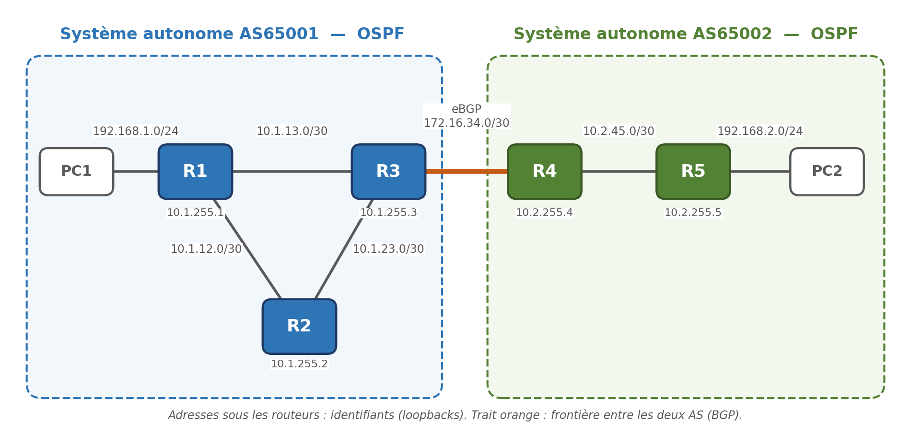

# Lab réseau FRR : OSPF + eBGP + automatisation Python

Lab de routage multi-AS entièrement conteneurisé (containerlab + FRRouting), piloté par des scripts Python/Netmiko :
contrôle de santé, sauvegarde des configs et détection de dérive de configuration.
Il tourne sur un simple PC portable sous WSL2, sans aucun matériel réseau.



| | |
|---|---|
| **Stack** | WSL2 (Ubuntu) · Docker 29 · containerlab 0.79 · FRRouting 10.2.1 · Python 3 · Netmiko 4.8 |
| **Routage** | OSPF (point-to-point, interfaces passives) dans chaque AS · eBGP filtré (prefix-list + route-map) entre AS65001 et AS65002 |
| **Automatisation** | `health.py` (état OSPF/BGP) · `backup.py` (sauvegardes + baseline) · `drift.py` (diff vs baseline, rapport Markdown) |
| **netcheck** | Validation de changements (état avant/après : routes, OSPF, BGP) · audit de conformité par règles YAML · rapports HTML · 2 drivers (FRR, SR Linux) |
| **v2 (multi-constructeurs)** | `lab-multivendor.clab.yml` : mêmes r1-r4, r5 = Nokia SR Linux 26.7.2 · registre de drivers + champ `drivers:` par règle de conformité + identifiants par driver |
| **v3 (audit de sécurité)** | `netcheck/rules/security.yml` : authentification OSPF (message-digest / keychain SR Linux) + TCP-MD5/GTSM/`maximum-prefix` sur eBGP + bannière SR Linux · rapports avant/après dans `docs/audit/` · secrets masqués dans les 3 sorties (`netcheck/secrets.py`) · `assert` (état attendu) · `guard` : changements prévus (`--expect`) et retour arrière prouvé (`--rollback`) · `monitor` : surveillance planifiée, alertes webhook uniquement au changement de statut |
| **Sécurité** | Commandes en lecture seule (liste blanche) · YAML chargé en `safe_load` · rapports protégés contre le XSS (testé) |

## Topologie

```
            AS65001 (OSPF area 0)                          AS65002 (OSPF area 0)
                                            eBGP
  pc1 ──── r1 ─────────── r3 ═══════════════════════════ r4 ─────────── r5 ──── pc2
            \            /        172.16.34.0/30
             \          /
              └── r2 ──┘
  LAN 192.168.1.0/24                                            LAN 192.168.2.0/24
```

| Lien | Réseau | Adresses |
|---|---|---|
| r1 eth1 ↔ r2 eth1 | 10.1.12.0/30 | r1 .1 / r2 .2 |
| r1 eth2 ↔ r3 eth1 | 10.1.13.0/30 | r1 .1 / r3 .2 |
| r2 eth2 ↔ r3 eth2 | 10.1.23.0/30 | r2 .1 / r3 .2 |
| r3 eth3 ↔ r4 eth1 (eBGP) | 172.16.34.0/30 | r3 .1 / r4 .2 |
| r4 eth2 ↔ r5 eth1 | 10.2.45.0/30 | r4 .1 / r5 .2 |
| LAN pc1 (r1 eth3) | 192.168.1.0/24 | r1 .1 / pc1 .10 |
| LAN pc2 (r5 eth2) | 192.168.2.0/24 | r5 .1 / pc2 .10 |
| Loopbacks AS65001 | 10.1.255.X/32 | r1 .1, r2 .2, r3 .3 |
| Loopbacks AS65002 | 10.2.255.X/32 | r4 .4, r5 .5 |
| Management (SSH) | 172.20.20.0/24 | r1 .11 … r5 .15, pc1 .21, pc2 .22 |

**Logique de routage**

- OSPF dans chaque AS : liens en `point-to-point` (adjacence immédiate, pas d'élection DR/BDR). LAN, loopbacks et lien eBGP sont en `passive` : annoncés, mais sans adjacence.
- eBGP entre r3 et r4. Chaque bord annonce son agrégat /16 et son LAN /24. L'agrégat s'appuie sur une route `Null0`, comme chez un opérateur.
- Filtrage entrant et sortant par `prefix-list` + `route-map`. FRR refuse d'échanger des routes eBGP sans politique (`ebgp-requires-policy`).
- r3 et r4 redistribuent les routes BGP dans OSPF : les routeurs internes les voient en externes (O E2).

## Arborescence

```
lab.clab.yml                    topologie containerlab (lab FRR)
lab-multivendor.clab.yml        topologie containerlab (lab v2 : FRR + Nokia SR Linux)
docker/Dockerfile               image FRR 10.2.1 + SSH (compte netops)
configs/daemons                 démons FRR activés
configs/rX/frr.conf             configuration de chaque routeur FRR (montée dans le conteneur)
configs-multivendor/r5/         config de démarrage SR Linux (syntaxe "set", lab v2)
automation/                     phase 2 : scripts Netmiko (health, backup, drift)
automation/inventory.yml            inventaire du lab FRR
automation/inventory-multivendor.yml inventaire du lab v2 (driver par routeur)
automation/monitor.sh               enveloppe à planifier (cron/systemd) pour `netcheck monitor`
netcheck/                       validation de changement et conformité (snapshot/diff/check/assert/guard/monitor)
netcheck/rules/                 règles de conformité (default.yml) et d'audit de sécurité (security.yml)
intents/                        états attendus du réseau, pour `netcheck assert` (lab FRR, lab v2)
docs/audit/                     rapports d'audit de sécurité avant/après durcissement (v3)
tests/                          fixtures et scénarios de bout en bout de netcheck
tests/expect/                   fichiers --expect de référence (changement prévu, effet de bord oublié)
tests/tools/webhook_recorder.py récepteur de webhook LOCAL (tests et scénarios, aucun appel externe)
tests/integration.sh                lab FRR (S1-S5, C1/C2, guard, A1/A2 assert, D1/D2 --expect et rollback, E1 monitor)
tests/integration_multivendor.sh    lab v2 (S1, coupure r4<->r5, C1, A1/A2 assert, M1 monitor)
test_lab.sh                     scénario de bout en bout du lab FRR (phases 1 et 2), 28 contrôles
test_lab_multivendor.sh         scénario de bout en bout du lab v2 (topologie + routage)
```

---

## Phase 1 : le lab de routage

### 0. Préparer WSL2 (une seule fois)

Dans Windows, crée `C:\Users\<toi>\.wslconfig` pour que WSL ne mange pas toute la RAM :

```ini
[wsl2]
memory=4GB
processors=4
```

Puis PowerShell : `wsl --shutdown`, et relance Ubuntu. Dans Ubuntu (WSL) :

```bash
# Docker Engine natif dans WSL (plus fiable que Docker Desktop avec containerlab)
curl -fsSL https://get.docker.com | sudo sh
sudo usermod -aG docker $USER      # puis ferme et rouvre le terminal

# containerlab
bash -c "$(curl -sL https://get.containerlab.dev)"
```

> Travaille dans le système de fichiers Linux (`~/lab-reseau-frr`), pas dans `/mnt/c/...`, qui est lent et pose des soucis de permissions.

### 1. Construire l'image et déployer

```bash
cd ~/lab-reseau-frr
docker build -t frr-ssh:10.2.1 docker/
sudo containerlab deploy -t lab.clab.yml
```

containerlab affiche un tableau des 7 conteneurs (`clab-frr-lab-r1` …). Compte ~30 s pour la convergence OSPF + BGP.

### 2. Vérifier, du bas vers le haut

```bash
docker exec -it clab-frr-lab-r1 vtysh          # CLI type Cisco ; 'exit' pour sortir
```

| Commande (dans vtysh) | Sur | Attendu |
|---|---|---|
| `show interface brief` | tous | interfaces Up avec la bonne IP |
| `show ip ospf neighbor` | r1, r2, r3 | 2 voisins `Full/-` (r4 et r5 : 1) |
| `show ip route ospf` | r1 | 10.1.23.0/30 en ECMP (2 chemins), 10.2.0.0/16 et 192.168.2.0/24 via r3 |
| `show bgp ipv4 summary` | r3, r4 | voisin `Established`, PfxRcd = 2, PfxSnt = 2 |
| `show bgp ipv4` | r3 | 4 préfixes : 2 locaux (next-hop 0.0.0.0), 2 via AS 65002 |
| `show ip route` | r1 | routes externes marquées `O>*` ; sur r3, les routes BGP marquées `B>*` |

Test de bout en bout :

```bash
docker exec clab-frr-lab-pc1 ping -c3 192.168.2.10
docker exec clab-frr-lab-pc1 traceroute -n 192.168.2.10
```

Chemin attendu (testé) : `192.168.1.1 → 10.1.13.2 → 172.16.34.2 → 10.2.45.2 → 192.168.2.10`.

### 3. Exercices (du plus simple au plus formateur)

1. **Convergence OSPF** : coupe le lien r1-r3 (`docker exec clab-frr-lab-r1 ip link set eth2 down`) et lance un `ping` continu depuis pc1. Le trafic doit repasser par r2 après environ 40 s (dead-interval). Réduis ensuite ce délai avec `ip ospf dead-interval minimal hello-multiplier 4` puis avec BFD.
2. **Ingénierie de trafic OSPF** : remets le lien, puis mets `ip ospf cost 100` sur r1 eth2. Vérifie avec traceroute que le chemin passe par r2.
3. **Politique BGP** : sur r3, supprime `192.168.1.0/24` de `PL-EBGP-OUT`, puis `clear bgp ipv4 * soft out`. pc2 ne doit plus joindre pc1 : explique pourquoi.
4. **BFD sur eBGP** : `neighbor 172.16.34.2 bfd` sur r3 (et l'équivalent sur r4), puis `show bfd peers`. Coupe le lien et compare le temps de bascule.
5. **Capture Wireshark** : `sudo ip netns exec clab-frr-lab-r3 tcpdump -i eth3 -w /tmp/bgp.pcap`, puis `clear bgp ipv4 *` sur r3. Ouvre le pcap depuis Windows (`\\wsl$\Ubuntu\tmp\bgp.pcap`) et identifie OPEN, UPDATE et KEEPALIVE.
6. **Multihoming** (avancé) : ajoute un second lien eBGP r2-r4 dans `lab.clab.yml`, puis joue avec `local-preference` (sortant) et `as-path prepend` (entrant) pour choisir le lien principal.

> Les changements faits dans vtysh sont perdus au redéploiement. Pour garder une modification, copie-la dans `configs/rX/frr.conf`.

---

## Phase 2 : automatisation (NetDevOps)

Les routeurs exposent SSH sur le réseau de management. Les scripts se connectent en `netops` (non-root, membre du groupe `frrvty`) et exécutent `vtysh` à distance. **Lance-les depuis WSL**, pas depuis Python Windows : le réseau 172.20.20.0/24 n'est joignable que depuis WSL.

```bash
cd ~/lab-reseau-frr/automation
python3 -m venv .venv && source .venv/bin/activate
pip install -r requirements.txt
```

| Script | Rôle | Code retour |
|---|---|---|
| `health.py` | voisins OSPF Full et sessions BGP comparés à `inventory.yml` (via les sorties JSON de FRR) | 0 OK / 1 KO |
| `backup.py [--baseline]` | running-config → `backups/<horodatage>/` ; `--baseline` fige la référence dans `baseline/` | 0 / 1 |
| `drift.py [--report f.md]` | diff running vs baseline, rapport Markdown en option | 0 conforme / 1 dérive / 2 erreur |

Tous acceptent `-r r1 r3` pour cibler des routeurs. Les connexions partent en parallèle (ThreadPoolExecutor) : un routeur en panne n'empêche pas de traiter les autres.

### Scénario de démo (testé)

```bash
python health.py                    # tout OK
python backup.py --baseline         # fige la référence

# Modification « sauvage » + panne simulée
docker exec clab-frr-lab-r2 vtysh -c 'conf t' -c 'interface eth1' -c 'ip ospf cost 50'
docker exec clab-frr-lab-r4 vtysh -c 'conf t' -c 'router bgp 65002' -c 'neighbor 172.16.34.1 shutdown'

python health.py                    # r3/r4 KO : BGP Active / Idle (Admin)
python drift.py --report drift_report.md
```

Sortie de `drift.py` :

```diff
=== r2 ===
@@ -6,4 +6,5 @@
  ip address 10.1.12.2/30
  ip ospf area 0
+ ip ospf cost 50
  ip ospf network point-to-point

=== r4 ===
@@ -24,4 +24,5 @@
  neighbor 172.16.34.1 description r3-AS65001
+ neighbor 172.16.34.1 shutdown
```

### Exercices phase 2

1. **Git** : `git init`, commit de `baseline/`, puis un commit à chaque `backup.py`. `git log -p backups/` donne l'historique des changements.
2. **Planification** : lance `drift.py` toutes les 15 minutes (cron dans WSL) et écris le rapport uniquement quand le code retour vaut 1.
3. **Remédiation** : écris `remediate.py`, qui transforme chaque ligne `+` du diff en `no <ligne>` (dans le bon contexte `interface`/`router`) et l'applique via `vtysh -c 'conf t' ...`. Relance ensuite `drift.py` pour prouver le retour à la conformité.
4. **Templates Jinja2** : génère les 5 `frr.conf` depuis un seul fichier YAML (plan d'adressage). C'est la base de l'infra-as-code.
5. **Nornir** : réécris `health.py` avec Nornir + nornir_netmiko, le standard pour passer à l'échelle.

---

## netcheck : validation de changement et conformité

Outil en ligne de commande (`netcheck/`) qui répond à deux questions : **« mon intervention
a-t-elle cassé quelque chose ? »** (snapshot avant/après + diff) et **« mes équipements
respectent-ils les règles de conception ? »** (audit de conformité contre des règles YAML).
Développé et testé sur ce lab, mais pensé pour s'étendre à d'autres constructeurs : voir
[netcheck/README.md](netcheck/README.md) pour l'architecture et le détail de sécurité.

> ⚠️ **N'utilisez netcheck sur un réseau réel qu'avec une autorisation écrite.** Même
> strictement en lecture seule (liste blanche de commandes, jamais de configuration), une
> découverte non autorisée d'un réseau qui ne vous appartient pas peut être illégale.

### Installation

```bash
cd ~/lab-reseau-frr/netcheck
python3 -m venv .venv && source .venv/bin/activate
pip install -r requirements-dev.txt   # ajoute pytest ; requirements.txt suffit en usage normal
```

Toutes les commandes s'utilisent avec `python -m netcheck`, lancées **depuis la racine du
dépôt** (comme les scripts de `automation/`, uniquement joignable depuis WSL).

### Les 5 commandes

#### `snapshot <nom> [-d r1 r3] [--force]`

Interroge tous les équipements en parallèle, écrit `snapshots/<nom>/<équipement>.json`.

```
$ python -m netcheck snapshot avant
Snapshot 'avant' écrit dans snapshots/avant
  r1       OK
  r2       OK
  r3       OK
  r4       OK
  r5       OK
```

#### `list`

```
$ python -m netcheck list
Nom                  Horodatage             Équipements
avant                2026-09-28T16:49:25+00:00 5
```

#### `diff <avant> <après> [--json f.json] [--html f.html]`

Compare deux snapshots, classe les constats par gravité (CRITIQUE / ATTENTION / INFO).
Exemple réel, après un `ip ospf cost 100` sur l'interface de r1 vers r3 :

```
$ python -m netcheck diff avant apres
┏━━━━━━━━━━━┳━━━━━━━━━━━━┳━━━━━━━━━━━┳━━━━━━━━━━━━━━━━━━━━━━━━━━━━━━━━━━━━━━━━━┓
┃ Gravité   ┃ Équipement ┃ Catégorie ┃ Message                                 ┃
┡━━━━━━━━━━━╇━━━━━━━━━━━━╇━━━━━━━━━━━╇━━━━━━━━━━━━━━━━━━━━━━━━━━━━━━━━━━━━━━━━━┩
│ ATTENTION │ r1         │ next_hop  │ next-hop modifié pour 10.1.23.0/30 :    │
│           │            │           │ [('10.1.12.2', 'eth1'), ('10.1.13.2',   │
│           │            │           │ 'eth2')] -> [('10.1.12.2', 'eth1')]     │
│ ATTENTION │ r1         │ metric    │ métrique modifiée pour 10.1.255.3/32 :  │
│           │            │           │ 10 -> 20                                │
│ INFO      │ r1         │ config    │ --- avant                               │
│           │            │           │ +++ après                               │
│           │            │           │ @@ -14,4 +14,5 @@                       │
│           │            │           │   ip address 10.1.13.1/30               │
│           │            │           │   ip ospf area 0                        │
│           │            │           │ + ip ospf cost 100                      │
│           │            │           │   ip ospf network point-to-point        │
│           │            │           │  exit                                   │
└───────────┴────────────┴───────────┴─────────────────────────────────────────┘
Verdict : ATTENTION  (0 critique(s), 8 attention, 1 info)
```

(sortie réelle tronquée à 3 des 9 constats pour la lisibilité ici — les 6 autres sont des
`next_hop`/`metric` du même type, sur les préfixes qui empruntent désormais le chemin via r2).

Sans rien changer entre les deux snapshots :

```
$ python -m netcheck diff avant avant
Aucun constat.
Verdict : OK  (0 critique(s), 0 attention, 0 info)
```

#### `check [--snapshot nom] [--rules f.yml] [--json f.json] [--html f.html]`

Audite les configurations contre `netcheck/rules/default.yml` (8 règles), en direct ou hors
ligne (`--snapshot`, aucune connexion). Sur le lab dans son état nominal :

```
$ python -m netcheck check
Aucune non-conformité.
Conformité : CONFORME  (0 non-conformité(s))
```

Après avoir retiré `neighbor 172.16.34.2 route-map RM-EBGP-IN in` sur r3 :

```
$ python -m netcheck check
┏━━━━━━━━━┳━━━━━━━━━━━━┳━━━━━━━━━━━━━━━━━━━━━━━━━┳━━━━━━━━━━━━━━━━━━━━━━━━━━━━━┓
┃ Gravité ┃ Équipement ┃ Règle                   ┃ Détail                      ┃
┡━━━━━━━━━╇━━━━━━━━━━━━╇━━━━━━━━━━━━━━━━━━━━━━━━━╇━━━━━━━━━━━━━━━━━━━━━━━━━━━━━┩
│ HAUTE   │ r3         │ ebgp-politique-entrante │ voisin eBGP 172.16.34.2     │
│         │            │                         │ sans route-map/prefix-list  │
│         │            │                         │ en entrée                   │
└─────────┴────────────┴─────────────────────────┴─────────────────────────────┘
Conformité : NON CONFORME  (1 non-conformité(s))
```

#### `guard --change script.sh [--wait 30] [--yes]`

Encadre automatiquement une intervention : snapshot avant, exécution de `script.sh` (c'est
**lui** qui modifie, jamais netcheck), attente de convergence (sondée en boucle, jamais une
pause fixe — délai maximum `--wait`), snapshot après, puis diff. `--yes` saute la confirmation
interactive (utile en script ou en CI). Les deux snapshots sont horodatés automatiquement.
`--expect` (changements prévus) et `--rollback` (retour arrière prouvé, codes retour 0 à 6) sont
décrits dans « [Changements attendus et retour arrière](#changements-attendus-et-retour-arrière-v3) ».
Depuis la v3, un script `--change` en échec rend au minimum le code 2.

### Codes retour

| Commande | 0 | 1 | 2 | 3 |
|---|---|---|---|---|
| `diff` / `guard` | OK | ATTENTION | ÉCHEC (≥ 1 CRITIQUE) | erreur d'utilisation / snapshot manquant |
| `check` | conforme | non-conformité(s) moyenne/basse | non-conformité critique/haute | règles ou équipement introuvable |
| `snapshot` | tout OK | au moins un équipement injoignable | — | snapshot existant sans `--force` |

### Écrire une règle de conformité

Une règle est une entrée YAML dans `netcheck/rules/default.yml` (ou un fichier passé à
`--rules`) :

```yaml
- id: identifiant-court-unique
  description: "Phrase humaine expliquant la règle."
  severity: critique | haute | moyenne | basse
  applies_to: all              # ou une liste explicite : [r3, r4]
  kind: line_present           # un des 6 types, voir le tableau ci-dessous
  pattern: "..."               # paramètre propre au kind
```

| `kind` | Paramètre(s) | Vérifie |
|---|---|---|
| `line_present` | `pattern` (regex) | la ligne doit exister dans la running-config |
| `line_absent` | `pattern` (regex) | la ligne ne doit apparaître nulle part |
| `bgp_neighbor_inbound_policy` | — | chaque voisin eBGP a une route-map/prefix-list en entrée |
| `bgp_neighbor_outbound_policy` | — | idem, en sortie |
| `ospf_passive_on_interfaces` | `pattern` (regex sur la description) | les interfaces concernées sont en `ip ospf passive` |
| `interface_description_required` | `exclude` (liste, optionnel) | toute interface avec IP, hors loopback, a une description |

Le fichier complet en tête de `netcheck/rules/default.yml` documente le format en détail. Les
règles sont chargées avec `yaml.safe_load` exclusivement : un fichier de règles malformé ou
contenant un tag Python (`!!python/...`) est refusé au chargement, jamais exécuté.

---

## Tester tout le lab en une commande

```bash
bash test_lab.sh            # teste tout et laisse le lab démarré
bash test_lab.sh --destroy  # teste tout puis détruit le lab
```

Le script enchaîne 28 contrôles automatiques et renvoie le code 0 si tout passe :

| Étape | Ce qui est vérifié |
|---|---|
| Prérequis | Docker sans sudo, containerlab, module venv de Python |
| Déploiement | construction de l'image, 7 conteneurs en état running |
| Routage | voisins OSPF Full sur chaque routeur, eBGP Established avec 2 préfixes dans chaque sens, route vers le LAN distant, ping et chemin exact pc1 → pc2 |
| Automatisation | environnement Python créé si besoin, `health.py`, `backup.py --baseline` et `drift.py` au vert |
| Pannes simulées | coût OSPF modifié sur r2 et session BGP coupée sur r4 : `health.py` et `drift.py` doivent les détecter, pc2 doit devenir injoignable |
| Retour à la normale | pannes annulées, session BGP rétablie, tous les contrôles de nouveau au vert |

`bash tests/integration.sh` fait de même pour netcheck : les scénarios S1 à S5 (diff), C1/C2
(conformité) et un `guard --change` de bout en bout, 30 contrôles, sur le lab déjà déployé.

## Lab multi-constructeurs (v2 : FRR + Nokia SR Linux)

Deuxième topologie, [`lab-multivendor.clab.yml`](lab-multivendor.clab.yml) : mêmes r1-r4 et
même adressage que le lab FRR (`configs/` **strictement inchangé**), mais r5 devient un vrai
équipement Nokia SR Linux (`ghcr.io/nokia/srlinux:26.7.2-519`) au lieu de FRR. Objectif :
vérifier que `netcheck` fonctionne réellement sur un lab hétérogène, pas seulement sur un
seul constructeur.

```
            AS65001 (OSPF area 0)                          AS65002 (OSPF area 0)
                                            eBGP
  pc1 ──── r1 ─────────── r3 ═══════════════════════════ r4 ─────────── r5 ──── pc2
            \            /        172.16.34.0/30                    (SR Linux)
             \          /
              └── r2 ──┘
  LAN 192.168.1.0/24                                            LAN 192.168.2.0/24
```

Réseau de management distinct (`172.20.21.0/24`) et nom de lab distinct
(`frr-lab-multivendor`) : les deux labs ne se mélangent jamais **et ne tournent jamais en même
temps** (même méthode de test des deux côtés : destroy le lab en cours avant de déployer
l'autre).

### Démarrage

```bash
sudo containerlab deploy -t lab-multivendor.clab.yml
```

r5 démarre depuis [`configs-multivendor/r5/config.cli`](configs-multivendor/r5/config.cli)
(syntaxe SR Linux `set`, appliquée dès le premier démarrage, sans intervention manuelle --
prouvé par plusieurs redéploiements à froid pendant le développement). Convergence OSPF
complète observée en ~25 s.

### Mesures réelles (WSL, 15 Gi de RAM disponible)

| | |
|---|---|
| Taille de l'image SR Linux | 752 789 953 octets (~718 Mo), vérifiée via l'API du registre GHCR avant le premier téléchargement |
| Temps de démarrage SR Linux | ~18 s entre `containerlab deploy` et une CLI `sr_cli` utilisable |
| RAM supplémentaire du lab mixte | ~1,9 Go, dont ~1,8 Go attribuables à r5 seul (mesurée par différence sur `free -h` ; `docker stats --no-stream` affiche 0B/0B pour r5 -- observé deux fois, sans source officielle confirmant un défaut connu, donc décrit ici comme une simple observation) |

### Deux pièges MTU (réellement rencontrés, pas anticipés)

**1. MTU du lien r4 ↔ r5.** La MTU par défaut d'un lien containerlab (veth) est 9500 octets ;
le châssis SR Linux de ce lab plafonne bien plus bas en pratique. Résultat observé : les
paquets DBD (Database Description) envoyés par FRR à 9500 étaient systématiquement rejetés
par SR Linux (compteur `Bad MTUs` non nul), l'adjacence restant bloquée en Exchange/ExStart
indéfiniment, sans erreur explicite côté FRR.

Point de vocabulaire important (corrigé après relecture) : **OSPF ne "négocie" pas le MTU, il
le contrôle.** Chaque routeur annonce sa propre MTU dans ses paquets DBD ; le voisin compare
cette valeur annoncée à *sa* MTU locale et rejette le paquet si l'annonce dépasse (RFC 2328,
section 10.6) -- ce n'est pas un accord négocié entre les deux MTU, mais un refus unilatéral
en cas de désaccord. `mtu-ignore` (contourner ce refus) est une extension propre à certains
constructeurs, **hors standard** : la RFC ne prévoit aucune façon officielle de l'ignorer.

Correctif retenu : fixer `mtu: 1500` (standard Ethernet) sur ce lien précis, dans
`lab-multivendor.clab.yml`, plutôt que du jumbo proche du plafond du châssis -- aligne les
deux côtés sans dépendre d'une limite matérielle propre à ce modèle particulier.

**2. `ip-mtu` doit rester strictement inférieur au `mtu` L2, d'au moins 14 octets.** Une fois
le MTU du lien aligné à 1500, la sous-interface SR Linux restait `down, reason
ip-mtu-too-large` tant que son `ip-mtu` (1500) n'était pas strictement inférieur au `mtu` L2
de l'interface porteuse. Correctif : `mtu 1514` sur l'interface L2, `ip-mtu 1500` sur la
sous-interface -- une marge de 14 octets, exactement la taille d'un en-tête Ethernet.
Constaté sur l'équipement réel, jamais dans la documentation officielle consultée : la règle
de conformité `srlinux-mtu-marge-suffisante` (netcheck) vérifie ce point en continu.

### Différences FRR / SR Linux qui comptent pour netcheck

| | FRR | SR Linux |
|---|---|---|
| CLI | `vtysh -c "..."`, impératif | `sr_cli -- "..."`, hiérarchique (datastores `show` / `info from state` / `info from running`) |
| Config texte | blocs `interface X ... exit`, à plat | blocs `interface X { ... }` imbriqués (JSON-like) |
| Next-hop d'une route | porté directement par la route | indirection à deux niveaux (`next-hop-group` -> `next-hop`), support ECMP natif |
| Type d'interface OSPF | `point-to-point` explicite (convention de ce lab) | défaut `broadcast` sur Ethernet -- `interface-type point-to-point` à positionner explicitement (règle `srlinux-ospf-point-to-point`) |
| Identifiants par défaut | `netops` / `netops` | `admin` / `NokiaSrl1!` (défaut de l'image containerlab, lab de développement uniquement) |

### Identifiants : variables par driver

`NETCHECK_USER`/`NETCHECK_PASS` s'appliquent à **tous** les routeurs, y compris ceux d'un
autre driver -- les positionner pour cibler FRR écraserait silencieusement les identifiants
SR Linux de r5, et inversement. Utiliser plutôt les variables spécifiques à un driver, plus
prioritaires que le générique :

```bash
export NETCHECK_SRLINUX_USER=admin
export NETCHECK_SRLINUX_PASS='NokiaSrl1!'
```

Ordre complet, du plus spécifique au moins spécifique : `NETCHECK_<DRIVER>_USER/PASS` >
`NETCHECK_USER/PASS` > `LAB_USER/PASS` > l'inventaire lui-même.

### Utiliser netcheck sur ce lab

```bash
python -m netcheck snapshot avant -i automation/inventory-multivendor.yml
python -m netcheck check -i automation/inventory-multivendor.yml
```

`bash test_lab_multivendor.sh` (topologie + routage, 15/15) et `bash
tests/integration_multivendor.sh` (netcheck sur les deux drivers à la fois : diff, coupure du
lien r4↔r5 vue des deux côtés, conformité, 13/13) couvrent ce lab de bout en bout -- voir
[netcheck/README.md](netcheck/README.md) pour le détail du registre de drivers.

## Audit de sécurité (v3)

`netcheck/rules/security.yml` durcit les deux labs (authentification OSPF, TCP-MD5 + GTSM +
`maximum-prefix` sur eBGP, bannière SR Linux), distinct de `default.yml` (bonnes pratiques de
conception, inchangé). Rapports avant/après dans [`docs/audit/`](docs/audit/) : `avant-*`
(lab non durci, Phase A -- **non conforme** volontairement, c'est le point de départ) et
`apres-*` (lab durci, Phase B -- **conforme** sur les deux labs).

```bash
python -m netcheck check --rules netcheck/rules/security.yml
python -m netcheck check --rules netcheck/rules/security.yml -i automation/inventory-multivendor.yml
```

### Ce que l'authentification OSPF et TCP-MD5 protègent réellement (et ce qu'elles ne protègent pas)

Les deux mécanismes (authentification OSPF message-digest, RFC 2328 Annexe D ; TCP-MD5 pour
BGP, RFC 2385) prouvent qu'un paquet vient bien d'un pair qui connaît le secret partagé -- ils
empêchent un tiers sans la clé d'injecter de fausses routes ou de couper une session en
usurpant l'adresse IP d'un routeur légitime (spoofing). **Ils ne chiffrent pas le trafic** : les
routes elles-mêmes (préfixes, next-hops) continuent de circuler en clair, visibles à quiconque
peut observer le lien -- ce n'est pas de la confidentialité, seulement de l'authentification
d'origine. Le MD5 utilisé par les deux est en outre cryptographiquement faible pour un usage
moderne (collisions connues) : c'est pourquoi TCP-AO (RFC 5925), qui corrige ce point, existe --
mais il est hors de portée de ce lab (voir plus bas). Ces mécanismes ne protègent pas non plus
contre un routeur légitime mal configuré ou compromis : une fois authentifié, il reste un pair
de confiance.

### Limites vérifiées en direct (pas supposées)

- **TCP-AO (RFC 5925) hors de portée** : ni le kernel WSL2 de ce lab (`CONFIG_TCP_AO` absent de
  `/proc/config.gz`) ni bgpd (FRRouting/frr#7240, jamais mergée) ne le supportent. TCP-MD5 est
  la seule authentification eBGP réaliste ici.
- **`service password-encryption` (FRR) ne chiffre rien** : accepté sans erreur mais la clé
  OSPF et le mot de passe BGP restent en clair dans `show running-config`, vérifié en direct.
  Les secrets de lab (`lab-ospf-*`, `lab-bgp-r3r4`) sont donc des valeurs de démonstration
  uniquement, jamais réutilisables ailleurs -- et les snapshots netcheck, qui contiennent ces
  clés en clair, restent hors Git (`.gitignore`). Les **rapports**, eux, les masquent
  systématiquement (`netcheck/secrets.py`) : `password ****`, jamais la valeur.
- **`banner motd` (FRR) absent de `security.yml`** : cette commande ne configure que la session
  vtysh elle-même (jamais partagée avec zebra/bgpd/ospfd, jamais persistée sans `write`) -- elle
  n'apparaît dans aucune sortie `show running-config`, donc netcheck ne peut pas la vérifier par
  sa méthode de collecte actuelle. La bannière de connexion SSH du conteneur, elle, dépend de
  `sshd` (Linux), hors du périmètre de netcheck. La bannière **SR Linux** (`login-banner`), elle,
  est bien vérifiable : voir plus bas.
- **`maximum-prefix` : comportement vérifié en direct en cas de dépassement.** La session passe
  immédiatement en `Idle (PfxCt)` -- pas d'attente du hold-timer. Elle **ne se rétablit pas
  automatiquement**, même après avoir relevé la limite au-dessus du nombre réel de préfixes :
  seul un `clear bgp <voisin>` explicite force une nouvelle négociation. Valeur retenue : **10**
  (marge ×5 sur les 2 préfixes réellement échangés aujourd'hui).
- **Authentification OSPF FRR ↔ SR Linux (lien r4↔r5)** : modèles de configuration différents
  (FRR : clé inline sur l'interface ; SR Linux : keychain nommée au niveau système, référencée
  depuis l'interface -- `set / system authentication keychain ... type ospf`), mais même
  mécanisme sur le fil. Seul le **MD5 classique** est commun aux deux constructeurs pour OSPF :
  FRR n'implémente aucune variante HMAC-SHA (RFC 5709), et le schéma YANG SR Linux interdit
  `hmac-md5`/`hmac-sha-*` pour une keychain de type `ospf` (réservés à `isis`) -- vérifié en
  sondant le schéma en direct. Interopérabilité confirmée par un déploiement à froid complet
  (adjacence Full des deux côtés en 15 secondes, sans intervention manuelle).
- **Stockage de la clé côté SR Linux** : `show system authentication` révèle la clé sous une
  forme obscurcie par la plateforme (`authentication-key $aes1$...$...$`), jamais en clair --
  mais ce n'est pas documenté comme un chiffrement sûr pour autant, donc masqué comme les autres
  secrets dans les rapports netcheck.

## Changements attendus et retour arrière (v3)

> ⚠️ **`guard` exécute des scripts sur les équipements** (les vôtres : netcheck n'en écrit jamais
> un seul, il reste en lecture seule). Un retour arrière automatique est une intervention comme
> une autre : **n'utilisez `guard --rollback` que sur un réseau dont vous avez l'autorisation
> écrite d'exploiter les équipements.**

### `--expect` : dire ce que l'intervention est censée changer

`diff` et `guard` acceptent `--expect fichier.yml`. Un constat que le fichier prévoit devient
**PRÉVU** : il reste affiché (avec sa gravité d'origine et le critère qui l'a prévu) mais n'entre
plus dans le verdict. Référence : [`tests/expect/ospf-cost-r1.yml`](tests/expect/ospf-cost-r1.yml).

```yaml
findings:                        # critères sur les constats du diff
  - id: r1-bascule-next-hop
    description: "r1 passe par r2 pour 5 préfixes"
    device: r1                   # obligatoire : un équipement précis (ni liste, ni "all")
    category: next_hop           # obligatoire : une catégorie réelle du diff
    pattern: "10\\.1\\.23\\.0/30" # optionnel : regex sur le message
    severity: attention          # optionnel : PLAFOND (défaut attention)
    count: 5                     # optionnel : nombre EXACT de constats attendus
after:                           # assertions (format `assert`) vraies APRÈS le changement
  - {id: chemin, description: "...", device: r1, type: path, prefix: 192.168.2.0/24, via: [r2, r3, r4, r5]}
```

| Situation | Résultat |
|---|---|
| constat couvert par un critère | PRÉVU, sans effet sur le verdict |
| critère sans aucun constat | ATTENTION « changement attendu absent » |
| `count` différent du nombre observé | ATTENTION « nombre de constats différent (attendu N, observé M) » |
| assertion `after` en ÉCHEC / NON ÉVALUABLE | ÉCHEC (CRITIQUE) / ATTENTION |

Garde-fous contre un critère qui masquerait un vrai problème, tous refusés **au chargement**
(code 3, avant la moindre action sur le réseau) : `device` et `category` obligatoires, motif trop
large (`.*`, `.+`, `.`, `^`...), clés inconnues. **Un constat CRITIQUE n'est jamais PRÉVU sans
`severity: critique` explicite** (c'est un plafond, pas une égalité). Exemple mesuré sur le lab : un
`ip ospf cost 100` sur r1 produit aussi un constat sur **r2** ; un fichier limité à r1 le laisse en
ATTENTION (`tests/expect/ospf-cost-r1-sans-r2.yml` le démontre).

### `guard --rollback` : retour arrière prouvé

```bash
python -m netcheck guard --change change.sh --rollback annule.sh \
    [--rollback-on echec|attention] [--script-timeout 120] [--expect attendu.yml] [--wait 30] [--yes]
```

Les **deux scripts sont affichés ensemble** puis confirmés **une seule fois** avant toute action.
Déroulé : snapshot avant → changement → convergence → snapshot après → diff (avec `--expect`) → si
le verdict atteint le seuil **ou si le script de changement échoue ou se bloque** : annulation
(**une seule exécution, jamais rejouée**) → convergence → snapshot « retour » → **preuve** : le diff
avant ↔ retour doit contenir **zéro constat, quelle qu'en soit la gravité** (un simple « verdict
OK » tolérerait une ligne de config restée). L'état est relevé plusieurs fois pendant `--wait`
(l'état finit parfois de se stabiliser après la convergence OSPF/BGP), mais le script, lui, ne
tourne qu'une fois. Chaque script a un délai (`--script-timeout`) : le **groupe de processus
entier** est tué (un `docker exec` fils bloqué ne survit pas) et le script compte comme en échec.

| Code | Situation |
|---|---|
| **0** | succès (OK, ou uniquement des constats prévus) |
| **1** | attention, aucun rollback déclenché |
| **2** | échec **sans** rollback (pas de `--rollback`) |
| **3** | erreur d'usage, **avant toute action** (script ou fichier introuvable/invalide, confirmation refusée) |
| **4** | échec **annulé avec succès** : retour à l'état initial prouvé |
| **5** | échec **et annulation échouée** : le réseau n'est pas dans son état initial (cadre rouge, liste des écarts restants) |
| **6** | **interrompu** (Ctrl+C ou SIGTERM) ou erreur interne : état inconnu, **aucun rollback lancé** |

Le code 5 est un état grave : message final dans un cadre rouge sur stderr, et une annulation est
aussi comptée en échec si le script d'annulation lui-même rend un code non nul ou se bloque, même
si l'état semble revenu. **Une interruption ne déclenche jamais d'annulation automatique** (on ne
sait pas où en était le réseau) : guard arrête le script en cours, écrit le journal avec
`final_state: INTERRUPTED` et l'étape concernée, et le dit.

> **Changement de comportement par rapport à la v0.2** : un script `--change` qui se termine avec
> un code non nul n'est plus un simple avertissement. Sans `--rollback`, `guard` rend désormais au
> minimum le **code 2** (une intervention dont le script échoue est une intervention échouée).

**Journal** `reports/guard_<horodatage>.json` (dossier ignoré par Git, comme `snapshots/`) :
chaque étape avec ses horodatages, les codes de sortie des scripts, les verdicts, la preuve du
retour, l'état final. Les scripts y figurent avec leur **SHA-256** et leur contenu **masqué** (un
script de changement peut contenir un secret) ; toute la sortie du journal passe par le masquage
des secrets. Au terminal, au contraire, les scripts s'affichent **en clair** : c'est votre fichier
local et il faut pouvoir lire exactement ce qu'on confirme.

## Surveillance planifiée et alertes (v3)

> ⚠️ `monitor` interroge les équipements à chaque exécution, toutes les quelques minutes. Ne le
> planifier que sur un réseau où vous avez une **autorisation écrite** : même en lecture seule, un
> relevé répété et non autorisé peut être illégal. Ce dépôt ne vise que le lab.

```bash
python -m netcheck monitor --baseline nominal [--intent intents/lab.yml] [--rules fichier.yml] \
    [--confirm N] [--webhook-format generic|discord] [--state-file f.json] [--dry-run] [-i inventaire]
```

**Une exécution = un relevé** (pas de démon : le planificateur est externe, voir plus bas). Un seul
relevé en direct sert au diff contre la référence, aux assertions (`--intent`) et à la conformité
(`--rules`) ; un composant dont l'entrée est absente n'est pas exécuté (« non exécuté » dans la
sortie). **Lecture seule stricte** : `monitor` ne lance jamais `guard`, aucun script, aucun
rollback (un test statique vérifie qu'il n'importe pas `guard`) ; il n'écrit que son état, son
verrou et ses rapports dans `reports/` (ignoré par Git).

**Statut global = le pire de quatre composants :**

| Composant | OK | ATTENTION | ÉCHEC |
|---|---|---|---|
| diff (contre `--baseline`) | aucun constat ≥ ATTENTION | constat ATTENTION | constat CRITIQUE |
| assert | tout OK | au moins une assertion **NON ÉVALUABLE** | au moins un ÉCHEC |
| check | conforme | violation `moyenne` / `basse` | violation `critique` / `haute` |
| collecte | tout joignable | | un équipement **injoignable** |

| Code | Situation |
|---|---|
| **0 / 1 / 2** | statut global OK / ATTENTION / ÉCHEC |
| **3** | refusé **avant toute collecte** (référence, intent ou règles introuvables ou invalides, `--confirm` < 1, `NETCHECK_WEBHOOK_URL` invalide) ou erreur interne : monitor n'a pas pu conclure, aucune alerte, état inchangé |
| **4** | exécution **ignorée** : une exécution précédente tient encore le verrou |

Une exception Python non gérée sortirait en code 1, que le planificateur lirait à tort comme
« ATTENTION » : toute erreur interne est donc convertie en code 3 avec un message.

### Anti-bruit : une alerte seulement quand le statut change

Le fichier d'état (`reports/monitor_state.json`, droits 0600, écrit de façon atomique) distingue
deux choses : **`observed`**, ce que le dernier relevé a vu, et **`notified`**, le dernier statut
**réellement annoncé** (webhook réussi).

```json
{
  "version": 1,
  "observed":  {"status": "ECHEC", "since": "2026-10-03T10:00:03+00:00", "at": "2026-10-03T10:05:02+00:00"},
  "notified":  {"status": "ECHEC", "at": "2026-10-03T10:00:04+00:00"},
  "candidate": null,
  "incident_since": "2026-10-03T10:00:03+00:00",
  "components": {"collect": "OK", "diff": "ECHEC", "assert": "ECHEC", "check": null},
  "baseline": "nominal",
  "last_report": "reports/monitor_2026-10-03_100003"
}
```

- Une alerte part quand `observed ≠ notified`, **dans les deux sens** et pour toute transition
  (OK → ATTENTION/ÉCHEC, ATTENTION → ÉCHEC, ÉCHEC → ATTENTION « amélioration », → OK « retour à la
  normale », avec la durée de l'incident). OK → ÉCHEC → ÉCHEC → OK donne exactement une alerte,
  aucune, puis un retour à la normale.
- **Première exécution** (pas de fichier d'état) : alerte seulement si le statut n'est pas OK.
- **Fichier illisible ou corrompu** (JSON invalide, version inconnue, champ absurde, binaire,
  dossier à la place du fichier) : monitor ne plante pas, garde une copie en `<fichier>.corrupt`,
  le traite comme une première exécution et le dit dans sa sortie.
- **Envoi en échec** : `notified` n'avance pas, donc l'exécution suivante réessaie. Sans cela, une
  alerte perdue serait supprimée à jamais par l'anti-bruit. Si l'incident est fini entre-temps, rien
  n'a été annoncé et rien ne l'est (le retour à la normale d'une panne jamais annoncée serait absurde).
- **`--confirm N`** (défaut 1) : un **nouveau** statut doit être observé N fois de suite avant
  d'être annoncé, aussi bien pour une dégradation que pour un retour à la normale. Le compteur
  (`candidate`) est dans le fichier d'état. Avec `--confirm 2`, une panne isolée (un SSH qui
  échoue une fois) n'envoie rien ; une panne persistante envoie une alerte à la 2ᵉ exécution. Le
  code retour, lui, est toujours le statut réel du relevé.
- **`--dry-run`** : affiche le message exact qui serait envoyé (même sans changement de statut, pour
  voir le format) ; n'envoie rien, n'écrit ni état ni rapport.

**Limites assumées**
- De **nouveaux constats pendant un ÉCHEC déjà annoncé n'envoient rien** (le statut n'a pas changé) :
  le rapport local est à jour, pas le salon.
- **Après un changement légitime, refaites la référence** : `python -m netcheck snapshot nominal
  --force`. Sinon le diff reste en ATTENTION ou ÉCHEC tant que l'état nominal d'hier est la référence.
- L'envoi précède l'écriture de l'état : un crash entre les deux renverrait la même alerte
  (livraison « au moins une fois »).

**Verrou** : un `flock` non bloquant sur `<état>.lock`, tenu pendant toute l'exécution (collecte
comprise). Une exécution qui trouve le verrou pris s'arrête proprement (code 4, âge du détenteur
affiché, aucune collecte, aucun état modifié). **Verrou orphelin** : le noyau libère un `flock` à la
mort du processus, même par `kill -9`, donc un crash ne peut pas laisser un verrou qui bloquerait les
exécutions suivantes (un fichier `.pid` qu'il faudrait deviner périmé, si). Un monitor bloqué dans une
collecte tiendrait le verrou : en systemd, `TimeoutStartSec=` l'arrête.

**Rapports** : `reports/monitor_latest/` est réécrit à chaque exécution (`diff`, `assert`, `check` en
JSON et HTML, plus `summary.json`) ; `reports/monitor_<horodatage>/` n'est écrit que quand un message
part, c'est le chemin cité dans l'alerte.

### Alertes par webhook

L'URL vient **uniquement** de la variable d'environnement `NETCHECK_WEBHOOK_URL` : c'est un secret
(quiconque la connaît peut poster dans le salon), jamais dans le dépôt ni en argument de commande.
Sans elle, monitor fonctionne et dit « alertes désactivées ».

- **https obligatoire** ; `http` n'est accepté que vers `localhost`, `127.0.0.1` et `[::1]` (tests).
  Identifiants dans l'URL, schéma inconnu, hôte absent : refusés (code 3, avant toute collecte).
- **Aucune redirection suivie** (un 3xx est un échec, la cible n'est jamais contactée), **délai de
  5 s** par opération réseau, **un seul réessai** (erreur réseau, délai dépassé ou 5xx ; jamais un 4xx).
  Tout 2xx vaut succès.
- **Un échec d'envoi est journalisé** (« webhook : échec d'envoi (HTTP 500) après 2 tentative(s) »)
  **sans changer le code retour** de monitor.
- **L'URL n'apparaît jamais** : ni dans la sortie, ni dans l'état, ni dans les rapports, ni dans un
  message d'erreur (celles-ci sont construites à partir du type d'erreur et du code HTTP, jamais de
  `str(exception)`, qui peut citer l'URL). Les formats d'URL Discord, Slack et Teams sont de plus
  reconnus et masqués par `secrets.py` partout où du texte est publié.

**Contenu d'une alerte** (liste blanche) : statut et statut précédent, horodatage, état de chaque
composant, équipements concernés, **au plus 10 constats** résumés (gravité, équipement, message
tronqué à 200 caractères, puis « et N autres »), chemin **relatif** du rapport local. Jamais de
configuration (pour la conformité : l'identifiant et la description de la règle, jamais le détail
qui peut citer une ligne de config) ; tout passe par le masquage des secrets.

`--webhook-format generic` (défaut) :

```json
{"source": "netcheck", "netcheck_version": "0.2.0", "event": "status_change", "kind": "degradation",
 "status": "ECHEC", "previous_status": "OK", "timestamp": "2026-10-03T10:05:02+02:00",
 "components": {"collect": "OK", "diff": "ECHEC", "assert": "ECHEC", "check": null},
 "devices": ["r1", "r3"],
 "findings": [{"severity": "CRITIQUE", "component": "diff", "device": "r1",
               "category": "ospf_neighbor", "message": "voisin OSPF perdu : 10.1.255.3"}],
 "more": 4, "report": "reports/monitor_2026-10-03_100502"}
```

`kind` vaut `first_report`, `degradation`, `improvement` ou `recovery` (alors `event: "recovery"`,
avec `incident_duration_s`). `--webhook-format discord` produit un embed (titre « 🔴 netcheck :
ÉCHEC (OK → ÉCHEC) », couleur par statut, constats en liste) avec **`allowed_mentions: {"parse": []}`
obligatoire** : les textes viennent d'équipements, aucun « @everyone » ne doit pouvoir sonner. La
description est limitée à 3500 caractères (la limite Discord est 4096, 6000 cumulés).

**Slack et Teams (documenté, non implémenté).** Seule la fonction qui construit le corps change ;
l'envoi (https, pas de redirection, 5 s, un réessai) reste identique.
- **Slack** : corps `{"text": "…"}` (avec `blocks` en option) ; la réponse réussie est **HTTP 200 avec
  `ok`**, pas 204 (d'où « tout 2xx vaut succès »). Pas d'embeds ni d'`allowed_mentions`.
- **Teams** : les connecteurs Microsoft 365 sont annoncés comme « nearing deprecation » : viser un
  webhook **Workflows**. Corps `{"type": "message", "attachments": [{"contentType":
  "application/vnd.microsoft.card.adaptive", "content": {…carte adaptative…}}]}` ; taille maximale
  28 Ko, limitation au-delà de 4 requêtes par seconde.

Références vérifiées : Discord, « Webhook Resource » (<https://docs.discord.com/developers/resources/webhook>)
et « Message Resource » (<https://docs.discord.com/developers/resources/message>) ; Slack, « Sending
messages using incoming webhooks »
(<https://docs.slack.dev/messaging/sending-messages-using-incoming-webhooks>) ; Microsoft, « Create an
Incoming Webhook - Teams | Microsoft Learn »
(<https://learn.microsoft.com/en-us/microsoftteams/platform/webhooks-and-connectors/how-to/add-incoming-webhook>).

### Planifier dans WSL

`automation/monitor.sh` est l'enveloppe à planifier. Elle fournit `NETCHECK_WEBHOOK_URL` à monitor
depuis `~/.config/netcheck/env` **sans jamais exécuter ce fichier** (pas de `source` : ce serait
exécuter du code toutes les 5 minutes) : le fichier est lu comme du texte, seule la ligne
`NETCHECK_WEBHOOK_URL=` est retenue (guillemets simples ou doubles retirés), toute autre ligne est
ignorée. Il doit appartenir à l'utilisateur, être un **fichier régulier** (pas un lien) et n'être
lisible que par lui (**0600**, ou 0400) : sinon refus avec un message clair (code 3). Une
`NETCHECK_WEBHOOK_URL` déjà exportée l'emporte sur le fichier.

À taper vous-même (rien de tout cela n'est fait par le dépôt, et aucun `sudo` n'est nécessaire) :

```bash
# 1. Enregistrer l'URL SANS qu'elle entre dans l'historique du shell
mkdir -p ~/.config/netcheck && chmod 700 ~/.config/netcheck
read -rsp 'URL du webhook : ' U; echo
( umask 077; printf "NETCHECK_WEBHOOK_URL='%s'\n" "$U" > ~/.config/netcheck/env ); unset U

# 2. La référence : l'état nominal, lab sain et déployé
cd ~/lab-reseau-frr && python -m netcheck snapshot nominal

# 3. Vérifier le message sans rien envoyer
automation/monitor.sh --baseline nominal --intent intents/lab.yml --webhook-format discord --dry-run
```

**Option recommandée : cron** (`crontab -e`, puis ajouter la ligne) :

```
*/5 * * * * /home/<vous>/lab-reseau-frr/automation/monitor.sh --baseline nominal --intent intents/lab.yml --confirm 2 --webhook-format discord >> /home/<vous>/lab-reseau-frr/reports/monitor.log 2>&1
```

`--confirm 2` : une panne doit être vue deux fois de suite (donc 5 à 10 minutes) avant d'alerter.
Le journal grossit d'environ 100 Ko par jour avec une sortie d'une ligne par exécution et n'est pas
roté (acceptable pour un lab ; `: > reports/monitor.log` le vide).

**Variante : timer systemd utilisateur.** Deux fichiers, puis activation :

```ini
# ~/.config/systemd/user/netcheck-monitor.service
[Unit]
Description=netcheck monitor (surveillance du lab)

[Service]
Type=oneshot
WorkingDirectory=%h/lab-reseau-frr
ExecStart=%h/lab-reseau-frr/automation/monitor.sh --baseline nominal --intent intents/lab.yml --confirm 2 --webhook-format discord
SuccessExitStatus=1 2
TimeoutStartSec=300

# ~/.config/systemd/user/netcheck-monitor.timer
[Unit]
Description=netcheck monitor toutes les 5 minutes

[Timer]
OnBootSec=2min
OnUnitActiveSec=5min

[Install]
WantedBy=timers.target
```

```bash
systemctl --user daemon-reload && systemctl --user enable --now netcheck-monitor.timer
systemctl --user list-timers
```

`SuccessExitStatus=1 2` : ATTENTION et ÉCHEC sont des statuts, pas des plantages de l'unité.

| | cron | timer systemd utilisateur |
|---|---|---|
| Prérequis dans WSL | service `cron` actif (`systemctl is-active cron` ; sans systemd, `sudo service cron start` à chaque démarrage) | `systemd=true` dans la section `[boot]` de `/etc/wsl.conf` (documenté par Microsoft pour les versions récentes de WSL) |
| Dépend d'une session ouverte | non : service système, lance les crontabs utilisateur | oui, sauf si `loginctl enable-linger <vous>` (modifie la configuration : non testé ici) |
| Journaux | fichier (`reports/monitor.log`) | journald (`journalctl --user -u netcheck-monitor`) |

Constaté sur la machine de développement : `systemd=true`, `cron.service` actif et activé,
gestionnaire systemd utilisateur actif, `Linger=no`.

**L'instance WSL doit rester active.** Rien ne s'exécute si WSL est arrêté (ni cron ni systemd ne
tournent alors), et un PC en veille met la VM en pause. Deux façons de l'éviter, avec leur coût :
1. **Garder un terminal WSL ouvert** pendant la surveillance (choix retenu pour ce lab) : aucun
   réglage, la VM s'arrête normalement quand on ferme tout.
2. **`instanceIdleTimeout=-1`** dans `%UserProfile%\.wslconfig` (section `[general]`, fichier à créer
   soi-même puis `wsl --shutdown`) : désactive l'arrêt automatique de l'instance. Coût : **la VM et le
   lab restent en mémoire en permanence** (les 7 conteneurs et leur RAM), même sans rien faire.
   Selon la documentation Microsoft (« Advanced settings configuration in WSL | Microsoft Learn »,
   <https://learn.microsoft.com/en-us/windows/wsl/wsl-config>), `instanceIdleTimeout` vaut 15000 ms par
   défaut et `vmIdleTimeout` (section `[wsl2]`) 60000 ms. Cette page ne dit pas si un processus de
   fond (cron, timer) compte comme une activité qui empêche l'arrêt : non vérifié, d'où la
   recommandation d'un terminal ouvert ou du réglage explicite.

## Dépannage

| Symptôme | Cause probable | Solution |
|---|---|---|
| `permission denied ... docker.sock` | utilisateur pas dans le groupe docker | `sudo usermod -aG docker $USER`, puis rouvrir le terminal |
| OSPF bloqué en `Init`/`ExStart` | interface mal nommée ou IP absente | `show interface brief` ; vérifier les `endpoints` du YAML |
| BGP `Active` en permanence | pas de joignabilité r3 ↔ r4 | `ping 172.16.34.2` depuis r3 ; `show bgp neighbor` |
| BGP `Established` mais 0 préfixe | politique ou route absente du RIB | `show ip prefix-list` ; `network` exige une route existante |
| Netmiko `TCP connection ... failed` | sshd non démarré ou script lancé depuis Windows | `docker exec clab-frr-lab-r1 /usr/sbin/sshd` ; lancer depuis WSL |
| `% Can't open configuration file vtysh.conf` | droits du fichier (non bloquant) | déjà géré par le Dockerfile et filtré par les scripts |
| PC qui rame | RAM WSL trop large ou autres VM | baisser `memory` dans `.wslconfig` ; fermer les autres VM |

## Arrêt et nettoyage

```bash
sudo containerlab destroy -t lab.clab.yml --cleanup
```

---

*Validation : lab déployé et testé sur un PC portable Windows (WSL2, Docker 29.8, containerlab 0.79, FRR 10.2.1). Résultats vérifiés : convergence OSPF/BGP, ping et traceroute pc1 → pc2, scripts health/backup/drift en SSH non-root, détection d'une panne BGP et d'une dérive de configuration simulées. netcheck : `pytest` au vert, `tests/integration.sh` (S1-S5, C1/C2, `guard`) 30/30 en conditions réelles sur ce même lab. Lab v2 (FRR + Nokia SR Linux) : `test_lab_multivendor.sh` et `tests/integration_multivendor.sh` (diff, coupure du lien r4↔r5 vue des deux côtés, conformité) également validés en conditions réelles -- voir la section "Lab multi-constructeurs" ci-dessus pour le détail.*

*Réalisé avec l'assistance de Claude (Anthropic) pour la conception, le code et la documentation. Le déploiement, les tests et la validation ont été faits sur ma machine. Le détail de la démarche est dans le rapport, section 2.4.*
